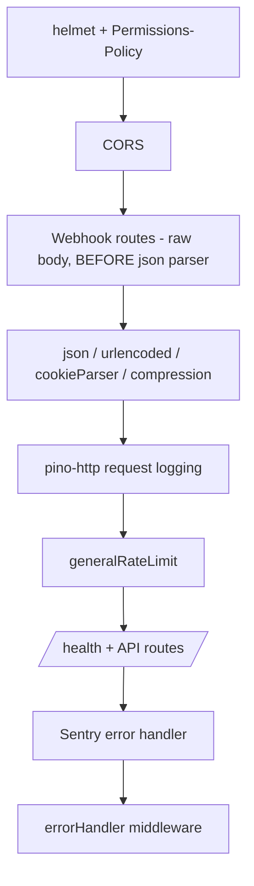

# API Backend

Package **`@travel/api`** at `apps/api`. Express 4 + Prisma 6 (PostgreSQL) + Socket.IO 4 + Zod + Pino + ioredis + Sentry + JWT/bcrypt. Runs via `tsx` in dev.

## Boot Sequence

`src/index.ts` → Sentry init (`./instrument`) → build app (`src/server.ts`) → wrap in HTTP server → attach Socket.IO → start cron jobs → graceful shutdown hooks.

> [!info] Composition Root
> All wiring lives in `src/config/dependencies.ts` — repositories → services → controllers → routes are instantiated there (manual DI). The Socket.IO instance is injected lazily via `setIoInstance`/`getIo` to avoid circular capture.

> [!warning] keepAliveTimeout / headersTimeout (`src/index.ts`)
> Set to `65_000`/`66_000` ms — longer than Node's 5s default. `apps/web`'s Next.js `rewrites()` proxies `/api/*` to this service over a pooled keep-alive connection; if this server's keep-alive window is shorter than the load balancer's (Render's front door included), Node can close a socket the LB/proxy still considers open, surfacing as `ECONNRESET`/"socket hang up" on the next request reused on that socket. Keep this above whatever idle timeout sits in front of the service.

## Folder Structure (`src/`)

| Folder          | Contents                                                                                                                                                             |
| :----------------| :---------------------------------------------------------------------------------------------------------------------------------------------------------------------|
| `config/`       | `env.ts` (Zod-validated env), `dependencies.ts` (DI), `cors.ts`, `redis.ts`, `razorpay.ts`, `cashfree.ts`, `firebase.ts`                                             |
| `controllers/`  | 18 files — admin, auth, booking, chat, destination, firebase-auth, notification, otp, payment-history, review, trip-category, trip, upload, vehicle, wallet, webhook |
| `routes/`       | 16 route files → [[API Routes Reference]]                                                                                                                            |
| `services/`     | 20 files + `trending/` — business logic (below)                                                                                                                      |
| `repositories/` | 22 Prisma data-access files, one per aggregate                                                                                                                       |
| `providers/`    | Pluggable adapters — OTP (msg91/mock), email (resend/nodemailer/mock), notification channels (in-app/email/sms/push), `payment/` gateways                            |
| `middleware/`   | auth, role, validate, error-handler, rate-limit, webhook-verify, cache-control, pino-http                                                                            |
| `socket/`       | Socket.IO server + chat/presence handlers → [[Background Jobs & Realtime]]                                                                                           |
| `utils/`        | constants, cron-jobs, cache-keys, chat-filter, redis-lock, request-context, slugify, trip-mapper, async-handler, …                                                   |
| `errors/`       | `app-error.ts` — AppError, AuthError, ForbiddenError, ValidationError, PaymentError, …                                                                               |
| `prisma/`       | `schema.prisma`, 34 migrations, seeds → [[Database Schema]]                                                                                                          |
| `tests/`        | 56 Vitest files → [[Testing & Quality]]                                                                                                                              |

## Request Pipeline (`src/server.ts`)

> [!warning] Webhook Ordering
> Webhook routes are mounted ==before the JSON body parser== so raw bytes are available for HMAC signature verification. Never move them below `express.json()`.

## Middleware

- **Auth** (`auth.middleware.ts`) — reads `Authorization: Bearer`, verifies JWT (HS256, `JWT_SECRET`, 15m expiry), sets `req.user = { userId, role }`, enriches AsyncLocalStorage logger context. See [[Auth & Security]].
- **Role guard** (`role.middleware.ts`) — `requireRole(...roles)`: 401 if unauthenticated, 403 `ForbiddenError` if role not allowed.
- **Validation** (`validate.middleware.ts`) — `validate(schema, 'body'|'query'|'params')` parses and *replaces* the request property; Zod errors → `ValidationError` with `{field, message}[]`. Schemas come from [[Shared Package#Validators (Zod)|@shared/validators]].
- **Error handler** — `AppError` → its `statusCode` + `{code, subCode?, message, details?}`; `ZodError` → 400 `VALIDATION_ERROR`; else 500 `INTERNAL_ERROR`. Always sets `Cache-Control: no-store`.
- **Rate limiting** — Redis-backed sliding window with in-memory fallback (races Redis vs 200ms timeout). Per-IP, 60s window: `general` 100, `auth` 10, `otp` 5, `webhook` 50, `booking` 20, `admin` 30. Sets `X-RateLimit-*`; 429 `RATE_LIMIT_EXCEEDED`.
- **Cache control** — `cacheControl(maxAge)` adds `public, max-age, stale-while-revalidate` on public GETs.

## Services Layer

| Service | Responsibility |
| :--- | :--- |
| `auth.service` | Signup/login/refresh/logout(-all), JWT issue/verify, refresh-token families + rotation, Google OAuth, profile + organizer updates, bank linking, organizer invites (7d JWT token), wallet auto-provisioning, login lockout |
| `otp.service` | Phone/email OTP send + verify (attempts, expiry) |
| `firebase-auth.service` | Verifies Firebase phone ID token → links/creates user → app JWTs |
| `trip.service` | Trip CRUD, publish/duplicate/delete, search, edit history, public organizer profiles, request creation, participant/summary views, caching |
| `trip-lifecycle.service` | Completes ended trips, releases SafePay escrow (with crash-recovery sweep) |
| `booking.service` | Create booking (seat holds + wallet), confirm/cancel/expire, verify + sync payment, `recoverPaidBooking`, `confirmBooking` (webhook path). Idempotency: existing PENDING_PAYMENT Razorpay bookings are returned as-is; Cashfree bookings and no-expiresAt rows always expire + create a fresh order (payment_session_id not stored in DB). Both expiry paths fire-and-forget `vehicleService.releaseSeats` so held seats are freed immediately rather than waiting for the cron. |
| `payment.service` | Provider-neutral orchestrator (Facade) → [[Payments & Webhooks]] |
| `payment-history.service` | Read models for payment/payout history & summaries |
| `review.service` | Create/update reviews, organizer replies, aggregate ratings |
| `wallet.service` | Balance, transactions, admin credit/debit, cashback, credit expiry + reminders, `reconcile()` drift check |
| `chat.service` | Conversations, messages, reactions, read receipts, unread counts, flagged messages |
| `notification.service` | Multi-channel dispatcher with per-type default channel map |
| `admin.service` | Organizer approvals, doc review, platform stats, cashback issuance, review moderation |
| `trip-category.service` | Category CRUD + trip-type request workflow |
| `vehicle.service` | Vehicle/seat-layout CRUD, seat maps, hold/release, `expireHeldSeats` |
| `upload.service` | Cloudinary signed-upload signatures |
| `cache.service` | Generic Redis cache-aside (`getOrSet`), graceful degradation |
| `sitemap.service` | Sitemap-data aggregation |
| `trending/` | Strategy pattern — `booking-velocity.strategy` scores by recent confirmed-booking velocity + start-date urgency |

> [!note] Deprecated
> ~~`mock-payment.service.ts`~~ — tombstone; replaced by `MockPaymentGateway` in `providers/payment/`.

## Key Backend Constants (`src/utils/constants.ts`)

| Constant | Value |
| :--- | ---: |
| `BOOKING_EXPIRY_MINUTES` | 60 |
| `APPROVAL_EXPIRY_HOURS` | 48 |
| `SEAT_HOLD_MINUTES` | 10 |
| `PLATFORM_COMMISSION_PERCENT` | 10 |
| `ESCROW_SAFETY_BUFFER_DAYS` | 90 |
| `WALLET_CASHBACK_PERCENT` | 5 |
| `WALLET_CREDIT_EXPIRY_DAYS` | 90 |
| `WALLET_MAX_ADMIN_CREDIT/DEBIT` | 50 000 |
| `MAX_COMPARE_TRIPS` | 3 |
| `MAX_PHOTOS_PER_TRIP` | 8 |
| `MIN_PRICE_PER_PERSON` | 100 |
| `DEFAULT_SUPPORT_EMAIL` | `support@safarnama.store` (Reply-To fallback when `SUPPORT_EMAIL` env is unset) |
| `MAX_GROUP_SIZE` | 50 |
| `JWT_ACCESS_EXPIRY` | 15m |
| `REFRESH_TOKEN_DAYS` | 7 |
| `OTP` | 4 digits, 10m expiry, 5 attempts, dev code `0000` |
| `CURRENCY` | INR |

Related: [[API Routes Reference]] · [[Database Schema]] · [[Payments & Webhooks]] · [[Background Jobs & Realtime]] · [[Auth & Security]]
