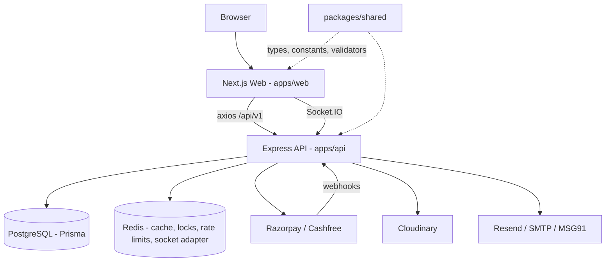

# Codebase Overview

**Safarnama** (working name *TripCompare*) — ==India's first group travel aggregator==. A marketplace where travelers discover, compare, and book curated group trips from verified organizers. See [[Product Domain]] for the full business context.

> [!info] Monorepo Layout
> npm workspaces + Turborepo. Root: `/Users/mandeep/Documents/practice/travel`
> - `apps/api` — Express 4 + Prisma 6 + PostgreSQL backend → [[API Backend]]
> - `apps/web` — Next.js 15 (App Router) + React 19 frontend → [[Web Frontend]]
> - `packages/shared` — constants, types, Zod validators shared by both → [[Shared Package]]

## Map of Content

### Product
- [[Product Domain]] — roles, features, business model, differentiators

### Backend
- [[API Backend]] — architecture, DI, services, middleware, repositories
- [[API Routes Reference]] — every endpoint, method, and guard
- [[Database Schema]] — all 26 Prisma models and enums
- [[Payments & Webhooks]] — Razorpay + Cashfree multi-gateway, SafePay escrow
- [[Background Jobs & Realtime]] — cron jobs, Socket.IO, notifications

### Frontend
- [[Web Frontend]] — Next.js structure, components, styling, SEO
- [[Frontend Routes Reference]] — full App Router route map
- [[Data Fetching & State]] — React Query, query keys, hooks, Zustand stores

### Cross-Cutting
- [[Auth & Security]] — JWT + refresh rotation, guards, rate limiting
- [[Shared Package]] — `@travel/shared` constants, types, validators
- [[Environment & Deployment]] — env vars, Docker, Render, deploy scripts
- [[Monorepo & Tooling]] — Turborepo, TypeScript config, npm scripts
- [[Testing & Quality]] — Vitest, Supertest, MSW, Playwright

## Tech Stack at a Glance

| Layer | Technology |
| :--- | :--- |
| Frontend | Next.js 15.5 (App Router, standalone), React 19.2, Tailwind 3.4, shadcn/ui (new-york), TanStack Query 5, Zustand 4, RHF + Zod |
| Backend | Express 4, TypeScript 5, Prisma 6, PostgreSQL 15, Redis (ioredis), Socket.IO 4, Zod, Pino |
| Payments | Razorpay (Route/SafePay) + Cashfree (Easy Split) behind a gateway interface |
| Auth | JWT (15m access / 7d rotating refresh), Google OAuth, Firebase phone OTP, email/SMS OTP |
| Media | Cloudinary signed uploads |
| Observability | Sentry (API + web), Pino with request context |
| Infra | Docker Compose (dev + prod), Render blueprint, Nginx + certbot |

## High-Level Architecture

> [!tip] Golden Rule of This Repo
> ==No magic strings==. Every domain value (role, status, sort field, query-key segment) lives in a constants file — see [[Shared Package#Constants]] and the root `CLAUDE.md`. IDs are ==UUIDv7== (`@default(uuid(7))`); validators accept both legacy cuid and UUID (never bare `z.string().uuid()`).
