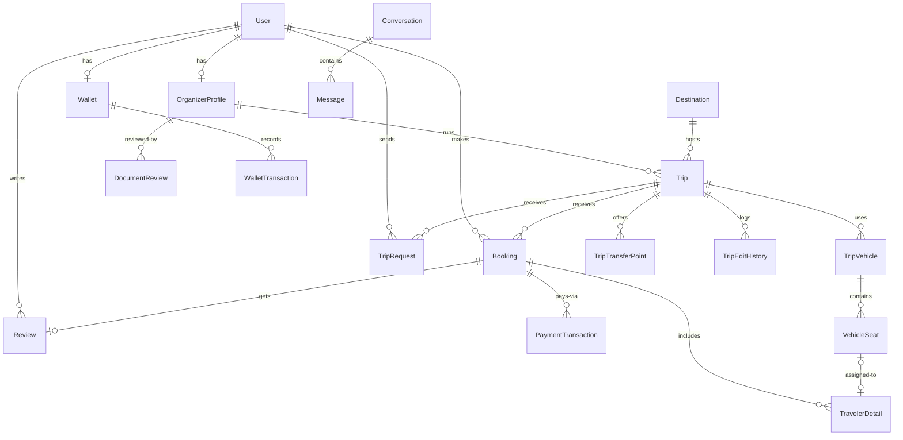

# Database Schema

Prisma 6 + PostgreSQL. Schema: `apps/api/prisma/schema.prisma` (`url = DATABASE_URL`, `directUrl = DIRECT_URL`). 43 migrations in `apps/api/prisma/migrations/` (latest: `20260724010000_add_traveler_detail_phone_verified`); scaling notes in `apps/api/prisma/DB_SCALING_RUNBOOK.md`.

> [!important] ID Strategy
> Every model uses ==`@id @default(uuid(7))` (UUIDv7)==. Legacy rows may hold cuid v1 — validators accept **both** (`idSchema` in [[Shared Package#Validators (Zod)|shared validators]]; never bare `z.string().uuid()`, it rejects v7).

> [!info] Conventions
> Most models carry the soft-delete quartet `isActive` / `isDeleted` / `deletedAt` plus `createdAt` / `updatedAt`. Several **partial unique indexes live only in raw SQL migrations** (active booking per user+trip, single REFUND per booking, admin-support conversation uniqueness). Money is stored as **integer paise/rupees (Int)**.

## Enums

| Enum                  | Values                                                                                                                                                                                            |
| :----------------------| :--------------------------------------------------------------------------------------------------------------------------------------------------------------------------------------------------|
| UserRole              | TRAVELER, ORGANIZER, ADMIN                                                                                                                                                                        |
| VerificationStatus    | PENDING, APPROVED, REJECTED, REVISION_REQUIRED                                                                                                                                                    |
| DocumentReviewStatus  | PENDING, APPROVED, REJECTED                                                                                                                                                                       |
| TripStatus            | DRAFT, ACTIVE, FULL, COMPLETED, CANCELLED                                                                                                                                                         |
| CancellationPolicy    | FLEXIBLE, MODERATE, STRICT                                                                                                                                                                        |
| BookingStatus         | PENDING_PAYMENT, CONFIRMED, CANCELLED, COMPLETED, REFUNDED, EXPIRED                                                                                                                               |
| PaymentType           | PAYMENT, REFUND, ESCROW_RELEASE, ==DEPOSIT_RELEASE, BALANCE_RELEASE== (Cashfree deposit/balance payout split, see [[Payments & Webhooks]]; ESCROW_RELEASE remains the Razorpay-only SafePay path) |
| PaymentStatus         | INITIATED, AUTHORIZED, CAPTURED, FAILED, REFUNDED                                                                                                                                                 |
| Gender                | MALE, FEMALE, OTHER, PREFER_NOT_TO_SAY                                                                                                                                                            |
| NotificationChannel   | EMAIL, SMS, PUSH, IN_APP, WHATSAPP                                                                                                                                                                |
| NotificationType      | 20 values (BOOKING_CONFIRMED, PAYMENT_RECEIVED, TRIP_REMINDER, CHAT_MESSAGE, ORGANIZER_APPROVED, WALLET_CREDIT_EXPIRING, …)                                                                       |
| VerificationCodeType  | EMAIL_VERIFY, PHONE_OTP, EMAIL_OTP, PASSWORD_RESET, ==BOOKING_CONTACT_OTP== — booking-scoped contact verification, kept distinct from `PHONE_OTP` so the two flows never invalidate each other's in-flight code for the same phone number |
| BookingMode           | INSTANT, REQUEST_BASED                                                                                                                                                                            |
| TripRequestStatus     | PENDING, APPROVED, REJECTED, EXPIRED, CONVERTED                                                                                                                                                   |
| TransferPointType     | PICKUP, DROP                                                                                                                                                                                      |
| ConversationType      | TRIP_CHAT, ADMIN_SUPPORT                                                                                                                                                                          |
| MessageType           | TEXT, IMAGE, FILE, SYSTEM                                                                                                                                                                         |
| ConversationStatus    | ACTIVE, ARCHIVED, CLOSED                                                                                                                                                                          |
| TripTypeRequestStatus | PENDING, APPROVED, REJECTED                                                                                                                                                                       |
| SeatStatus            | AVAILABLE, HELD, BOOKED, BLOCKED                                                                                                                                                                  |
| WalletTransactionType | REFUND, CASHBACK, BOOKING_DEDUCTION, ADMIN_CREDIT, ADMIN_DEBIT, PROMOTIONAL_CREDIT, EXPIRY                                                                                                        |

## Entity Relationships (core)

## Models (30)

### Identity & Organizer

- **User** — `name`, `email?` *(unique)*, `phone?` *(unique)*, `passwordHash?`, `googleId?` *(unique)*, `role`, `avatarUrl?`, `aadhaarVerified`/`phoneVerified`/`emailVerified`, ==`isReseller` (Boolean, default false)== — flipped true by `ResellerService.generateMainLink` when an organizer names this user's email; NOT a role, just a flag on a TRAVELER. ==`tncAcceptedAt?` (DateTime)== — server-stamped when a user completes traveler signup (`POST /auth/signup`, `acceptedTerms` literal-true validator) or is created via `POST /auth/google` (`acceptedTerms: true` in the request body, enforced only for new-user creation — existing users logging back in aren't re-checked). Initial-acceptance timestamp only — no version field, no re-consent flow. Relations: organizerProfile?, bookings[], reviews[], sentMessages[], conversations[] (as traveler), refreshTokens[], verificationCodes[], notifications[], cancelledBookings[] (as canceller), tripRequests[], tripEdits[], wallet?, organizerInvitesSent[], whatsappBroadcasts[], resellerMainLinks[] (as reseller), resellerSublinks[] (as reseller), sublinkAttributions[].
- **OrganizerProfile** — `userId` *(unique)*, `businessName`, `slug` *(unique)*, `description?`, `verificationStatus`, `documents (Json)?`, `rating`, `totalReviews`, `totalTripsCompleted`, `bankAccountLinked`, ==`commissionRate` (Decimal 5,2, default 10)==, `razorpayAccountId?`, `cashfreeVendorId?`, ==`organizerTncAcceptedAt?` (DateTime)== — server-stamped only when organizer-invite registration completes (`POST /auth/signup/:token`) after checking the "Organizer Agreement" consent box (`acceptedOrganizerAgreement` literal-true validator); lives here rather than on `User` because the agreement is accepted at the moment this profile is created, and only organizers ever have one. Initial-acceptance timestamp only — no version field, no re-consent flow. Relations: trips[], conversations[], tripTypeRequests[], documentReviews[], reviewComments[].
- **DocumentReview** — `organizerId`, `docType` (aadhaarFront/aadhaarBack/panCard), `status`, `currentUrl?`, `reviewedAt?`, `reviewedBy?`. *Unique(organizerId, docType)*.
- **DocumentReviewComment** — `organizerId`, `authorId`, `authorRole`, `docType?`, `comment`, `attachmentUrl?`.
- **OrganizerInvite** — `email` *(unique)*, `token` *(unique)*, `sentAt`, `acceptedAt?`, `sentBy?` → User.

### Trips

- **Destination** — `name`, `slug` *(unique)*, `state`, `photoUrl?`, `description?`, `tripCount`, `isPopular`.
- **Trip** — `organizerId`, `destinationId`, `title`, `slug` *(unique)*, `tripType`, `description`, `itinerary (Json)`, `startDate`/`endDate`, `bookingDeadline?`, `pricePerPerson (Int)`, `earlyBirdPrice?`/`earlyBirdDeadline?`, `minGroupSize`/`maxGroupSize`, `currentBookings`, ==`trendingScore?` (Float, cron-recomputed)==, `version`, `inclusions`/`exclusions (Json)`, `cancellationPolicy`, `photos (String[])`, `itineraryDocUrl?`, `status`, `bookingMode`, `acceptingBookings` (+ `bookingsPausedReason`/`bookingsPausedBy` — note: field names are `bookingsPaused*`, not `paused*`), `isHidden` (+ `hiddenReason`/`hiddenBy`), `seatSelectionEnabled`. Heavy composite indexes for search/sort (incl. pg_trgm for review search per latest migration). `isHidden`/`hiddenReason`/`hiddenBy`/`bookingsPausedReason`/`bookingsPausedBy` were added to schema.prisma in commit `9c30628` without a migration (dev DBs got them via `prisma db push`); the missing migration `20260721195050_add_trip_hidden_and_bookings_paused_fields` was generated after the fact to bring production in sync.
- **TripTransferPoint** — `tripId`, `type` (PICKUP/DROP), `label`, `address?`, `time?`, `extraCharge`, `sortOrder`.
- **TripEditHistory** — `tripId`, `editedById`, `snapshot (Json)`, `changedFields (String[])`, `editNote?`.
- **TripCategory** — `value` *(unique)*, `label`, `icon?`, `isActive`, `sortOrder`.
- **TripTypeRequest** — `organizerId`, `suggestedName`, `reason`, `status`, `adminNote?`, `reviewedAt?`.

### Bookings & Seats

- **Booking** — `bookingRef` *(unique)*, `tripId`, `userId`, `numTravelers`, `totalAmount`, `walletAmount`, `tripProtection`, `bookingStatus`, `expiresAt?`, `cancellationReason/At/ById`, `pickupPointId?`/`dropPointId?` → TripTransferPoint, `tripReminderSentAt?`, ==`sublinkId?` → ResellerSublink== (nullable — non-reseller bookings unaffected), ==`markupAmount` (Int, default 0)== — frozen snapshot (`markupPerPerson × numTravelers`) at booking time, never recomputed later. Raw partial-unique: ==one active booking per (user, trip)==.
- **TripRequest** — `tripId`, `userId`, `numTravelers`, `message?`, travelerDetails[], `status`, `respondedAt?`, `responseNote?`, `approvalExpiresAt?`, `bookingId?` *(unique)*. *Unique(tripId, userId)*.
- **TravelerDetail** — `bookingId?` | `tripRequestId?`, `name`, `phone?`, ==`phoneVerified` (Boolean, default false)== — set `true` only by the post-payment booking-contact-verification flow (`BookingRepository.upsertPrimaryContact`, migration `20260724010000_add_traveler_detail_phone_verified`); completely independent from and never mirrors `User.phoneVerified` — see [[Auth & Security]] for why. `age?`, `gender?`, `isPrimary`, `emergencyContactName/Phone?`. Relation: assignedSeat? (VehicleSeat). ==Raw partial-unique: one active primary contact per booking== (`(bookingId) WHERE isPrimary AND NOT isDeleted`, migration `20260724020000_add_traveler_detail_primary_contact_unique_index`) — not representable as a Prisma `@@unique`, guards `upsertPrimaryContact` against a concurrent-request race creating two primary rows for the same booking.
- **TripVehicle** — `tripId`, `label`, `vehicleType`, `sortOrder`, grid (`rows`/`cols`/`aisleAfterCol?`/`driverRow`/`driverCol`), `layout (Json)`, `photos (String[])`.
- **VehicleSeat** — `tripVehicleId`, `row`/`col`/`seatLabel`/`seatNumber`, `status` (SeatStatus), `bookingId?`, `travelerDetailId?` *(unique)*, `heldAt/heldUntil/heldByUserId`. *Unique(tripVehicleId,row,col)* and *(tripVehicleId,seatNumber)*.

### Money

- **PaymentTransaction** — `bookingId`, `type` (PaymentType), `amount (Int)`, `currency`, `provider` (razorpay/cashfree), provider-neutral `gatewayOrderId/PaymentId/RefundId/TransferId` + legacy `razorpay*` columns, `status`, `failureReason?`, `metadata (Json)?`. Raw partial-unique: ==one REFUND per booking==, plus ==one DEPOSIT_RELEASE per booking== and ==one BALANCE_RELEASE per booking== (`PaymentTransaction_bookingId_deposit_release_unique` / `PaymentTransaction_bookingId_balance_release_unique`, mirroring the pre-existing `PaymentTransaction_bookingId_escrow_release_unique`) — DB-level idempotency backstop against a duplicate deposit/balance gateway payout call. For Cashfree bookings, the `DEPOSIT_RELEASE` row's `metadata.computedSplit` carries `{ entitlement, deposit, balance, baseAmount, commissionRate, hoursUntilTrip }` plus a frozen `startDate` (ISO string) snapshot of the trip's start date *as of deposit-release time* — see [[Payments & Webhooks]] for why the frozen snapshot exists (prevents a later trip reschedule from manufacturing refund eligibility). Composite `@@index([bookingId, type])` (migration `20260719180000_add_payment_transaction_booking_id_type_index`) backs `PaymentTransactionRepository.findBalanceReleaseEligibleBookings`'s `paymentTransactions: { none: { type: ... } }` relation filters — a correlated NOT EXISTS scoped to `bookingId`+`type`, replacing two prior unbounded full-table scans. Composite `@@index([type, provider])` (migration `20260720000000_add_payment_transaction_type_provider_index`) backs the same query's outer filter (`type = 'DEPOSIT_RELEASE' AND provider = 'cashfree'`) — verified via `EXPLAIN ANALYZE` that without it, Postgres falls back to an index scan on `provider` alone plus an in-memory `Filter` on `type`, which grows linearly with the cashfree-`PAYMENT`-row count as the table scales.
- **Wallet** — `userId` *(unique)*, `balance (Int)`, `currency`. Raw ==CHECK constraint `balance >= 0`==.
- **WalletTransaction** — `walletId`, `amount (Int)`, `type`, `referenceModel?`/`referenceId?` (polymorphic), `description`, `balanceBefore`/`balanceAfter`, `expiresAt?`, `expiryReminderSentAt?`. *Unique(type, referenceModel, referenceId)* — idempotency guard.

### Reviews, Chat, Notifications

- **Review** — `tripId`, `bookingId` *(unique — one review per booking)*, `userId`, `overallRating` + `organization/value/safety/accuracy` ratings?, `comment?`, `photos (String[])`, `editedAt?`, `organizerReply?`/`organizerReplyAt?`.
- **Conversation** — `type`, `status`, `tripId?`, `travelerId`, `organizerProfileId?`, `adminId?`, `lastMessageAt?/Preview?`, `unreadCountTraveler`/`unreadCountOrganizer`. *Unique(type, tripId, travelerId)* + raw partial unique for admin-support.
- **Message** — `conversationId`, `senderId`, `type`, `content`, ==`clientMsgId?` (idempotency)==, `originalContent?`, `isFlagged`, `readAt?`, `fileUrl/Name/Size?`, `reactions (Json)`, `replyToId?` (self-relation). *Unique(conversationId, senderId, clientMsgId)*.
- **Notification** — `userId`, `channel`, `type`, `title`, `body`, `data (Json)?`, `sentAt?`, `readAt?`, `failureReason?`.

### WhatsApp

- **WhatsappBroadcast** — `createdByAdminId` → User, `message`, `templateName`, `targetType` (ALL_USERS/BY_ROLE/PHONE_LIST), `targetRole?`, `totalCount`, `successCount`, `failureCount`, `status` (PENDING/PROCESSING/COMPLETED/FAILED), `completedAt?`. Indexes on `createdByAdminId`, `status`, `createdAt`.

### Reseller

- **ResellerMainLink** — `token` *(unique, opaque)*, `tripId` → Trip, `organizerId` → OrganizerProfile, `resellerId` → User, `resellerEmail` (match/display key), `isActive`. ==`@@unique([tripId, resellerId])`== — one main link per (trip, reseller) pairing; re-inviting the same reseller for the same trip is a no-op at the service layer (`ResellerService.generateMainLink` returns the existing link) rather than a new row or an error. This row is purely internal linking/plumbing — never rendered to any role as a token, a "link", or a listable entity (see [[Product Domain]]). Indexes: `[organizerId]`, `[tripId]`, `[resellerId]`.
- **ResellerSublink** — `token` *(unique, opaque — the `?ref=` value)*, `mainLinkId` → ResellerMainLink, `resellerId` → User *(denormalized)*, `tripId` → Trip *(denormalized, for single-row price resolve)*, `markupAmount` (Int, default 0, rupees **per person**), `label?`, `isActive`. Indexes: `[mainLinkId]`, `[resellerId]`, `[tripId]`.
- **SublinkAttribution** — `userId` → User, `sublinkId` → ResellerSublink, `tripId` *(denormalized)*. ==`@@unique([userId, tripId])`==, written via upsert (**last-wins**: a newer sublink for the same user+trip overwrites the earlier attribution). Index `[sublinkId]`.

Both models use `crypto.randomBytes(32).toString('base64url')` for `token` — same opaque-token pattern as `OrganizerInvite`.

### Auth & Audit

- **RefreshToken** — `userId`, `tokenHash` *(unique)*, `familyId?`, `deviceInfo?`, `ipAddress?`, `expiresAt`, `revokedAt?` → [[Auth & Security#Refresh Token Rotation]].
- **VerificationCode** — `userId?`, `type`, `identifier`, `codeHash`, `expiresAt`, `usedAt?`, `attempts`.
- **WebhookEvent** — `source`, `externalEventId`, `eventType`, polymorphic `referenceModel?/referenceId?`, `externalId?`, `headers/payload/response (Json)`, `status` (default RECEIVED), `mode`, `failureReason?`, `attempts`, `processedAt?`. *Unique(source, externalEventId)*.

> [!warning] WebhookEvent Is Immutable
> It is an ==append-only audit trail== — no soft-delete fields. Old terminal events are purged by a daily cron (>90 days). See [[Background Jobs & Realtime#Cron Jobs]].

## Migrations & Seeds

- Migrate (dev): `npm run db:migrate` (`prisma migrate dev`) in `apps/api`. Docker dev entrypoint and prod Dockerfile CMD both run `prisma migrate deploy` on start → [[Environment & Deployment]].
- Seeds: `prisma/seed.ts` (dev), `prisma/seed.prod.ts` (prod), `prisma/seed-refund-test.ts` (refund fixtures).

Related: [[API Backend]] · [[Payments & Webhooks]] · [[Shared Package]]
