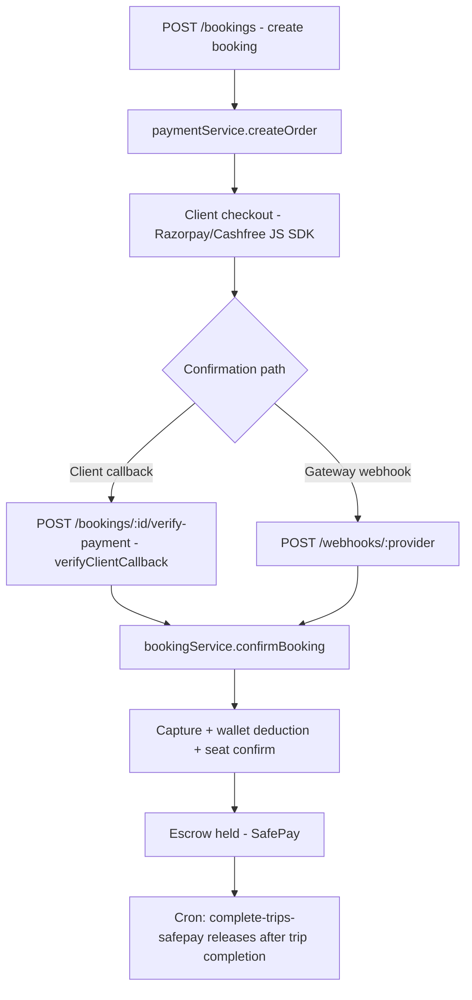

# Payments & Webhooks

Multi-gateway payments via ==Strategy + Factory registry== built in `apps/api/src/config/dependencies.ts`. Active gateway chosen by `PAYMENT_GATEWAY` env (default `razorpay`); falls back to `MockPaymentGateway` in non-prod when unconfigured, ==throws at startup in prod==. The registry keeps **all** configured gateways so refunds/webhooks route to the originating provider (`resolveProviderFromTx` reads `PaymentTransaction.provider`).

## The Gateway Contract

`apps/api/src/providers/payment/payment-gateway.interface.ts` — `IPaymentGateway`:
`createOrder`, `capturePayment`, `verifyClientCallback`, `checkOrderStatus`, `fetchPaymentIdForOrder`, `initiateRefund`, `fetchTransferId`, `releaseTransferHold`, `createPayoutAccount`, `verifyAndParseWebhook`, `normalizeEventType`.

> [!warning] Contract Rules
> All amounts are in ==paise==. `verifyAndParseWebhook` MUST throw on a bad signature. Status vocabularies are normalized in `providers/payment/payment.constants.ts`.

## Providers

### Razorpay (`razorpay.gateway.ts`, config `config/razorpay.ts`)
- Route **linked accounts** for organizers; transfers created with `on_hold` = SafePay escrow.
- Escrow released by [[Background Jobs & Realtime#Cron Jobs|cron]] `complete-trips-safepay` via `releaseTransferHold`.
- `createPayoutAccount` requires `params.pan` — Razorpay's Route API rejects `business_type: 'individual'` linked accounts without `legal_info.pan` (400). Same requirement as Cashfree's vendor KYC guard.
- The `razorpay` SDK throws plain objects (`{ statusCode, error: {...} }`), not `Error` instances, which breaks Sentry's cause-chain linking. `toGatewayError()` normalizes these into real `Error`s before wrapping in `PaymentError` so the underlying Razorpay failure reason is visible in Sentry.

### Cashfree (`cashfree.gateway.ts`, config `config/cashfree.ts`)
- Base URLs: sandbox `https://sandbox.cashfree.com/pg`, prod `https://api.cashfree.com/pg`; API version ==`2025-01-01`==; gated by `isCashfreeConfigured()`.
- **Easy Split**: `createOrder` includes `order_splits[]` for the organizer payout; `createPayoutAccount` creates an Easy Split vendor (`POST /easy-split/vendors`, stored as `OrganizerProfile.cashfreeVendorId`).
- `capturePayment` is a **no-op** (auto-captured); `releaseTransferHold` is a **no-op** (settlement via vendor `schedule_option` — T+1 / instant).
- `initiateRefund` performs pro-rata split reversal.
- Webhook signature: HMAC-SHA256 of `timestamp + rawBody`, base64, header `x-webhook-signature`.

## Order Flow

Manual reconciliation: `POST /bookings/:id/sync-payment` polls the gateway and repairs state. Instant bookings expire after ==60 minutes== unpaid (cron polls the gateway before expiring and can `recoverPaidBooking` if a webhook was missed).

## Webhook Handling

- Routes: `POST /api/v1/webhooks/razorpay` and `/cashfree`, mounted with `express.raw()` ==before the JSON parser== + `webhookRateLimit`. Each mounts only if its `*_WEBHOOK_SECRET` is set.
- `webhook.controller.ts` responds **200 immediately**, then processes asynchronously via `setImmediate()`:
  1. `paymentService.handleWebhook` — verify signature, record [[Database Schema#Auth & Audit|WebhookEvent]], idempotency via *unique(source, externalEventId)* (duplicates skipped).
  2. `processWebhookEvent` — dispatch by normalized event type.
  3. On `PAYMENT_AUTHORIZED` / `ORDER_PAID`: resolve booking from order id → `bookingService.confirmBooking`.

> [!tip] No Queue System
> There is **no BullMQ** — webhook processing is `setImmediate` async. Idempotency + the sync-payment endpoint + recovery crons are the safety net.

## Refunds

- Refund percent from [[Product Domain#Refund Policy Matrix|cancellation policy matrix]] (`@travel/shared` `calculateRefundPercent`).
- A refund creates a single `REFUND` PaymentTransaction — enforced by a ==DB partial-unique index== (one REFUND per booking).
- Cashfree refunds reverse splits pro-rata; Razorpay refunds via API.

## Frontend Side

- SDK loaders: `apps/web/src/lib/razorpay.ts`, `apps/web/src/lib/cashfree.ts`.
- Return handler page: `/payment-complete` → [[Frontend Routes Reference]].
- Hooks: `use-create-booking`, `use-verify-payment`, `use-sync-payment` → [[Data Fetching & State]].

> [!warning] Cashfree Go-Live
> Before declaring the Cashfree integration production-ready, walk the go-live checklist in `.claude/skills/cashfree-skills/pg/go-live/SKILL.md` (domain whitelisting, webhook signature verification, env-var swap, backend re-verify, dead-code cleanup).

Related: [[API Backend]] · [[Database Schema]] · [[Background Jobs & Realtime]] · [[Environment & Deployment]]
