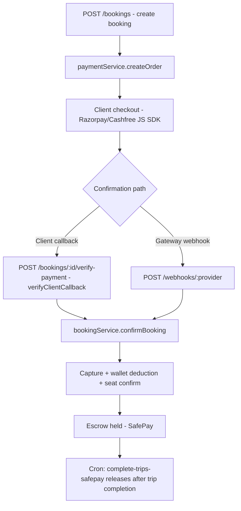

# Payments & Webhooks

Multi-gateway payments via ==Strategy + Factory registry== built in `apps/api/src/config/dependencies.ts`. Active gateway chosen by `PAYMENT_GATEWAY` env (default `razorpay`); falls back to `MockPaymentGateway` in non-prod when unconfigured, ==throws at startup in prod==. The registry keeps **all** configured gateways so refunds/webhooks route to the originating provider (`resolveProviderFromTx` reads `PaymentTransaction.provider`).

## The Gateway Contract

`apps/api/src/providers/payment/payment-gateway.interface.ts` — `IPaymentGateway`:
`createOrder`, `capturePayment`, `verifyClientCallback`, `checkOrderStatus`, `fetchPaymentIdForOrder`, `initiateRefund`, `fetchTransferId`, `releaseTransferHold`, `createPayoutAccount`, `verifyAndParseWebhook`, `normalizeEventType`.

> [!warning] Contract Rules
> All amounts are in ==paise==. `verifyAndParseWebhook` MUST throw on a bad signature. Status vocabularies are normalized in `providers/payment/payment.constants.ts`.

## Providers

### Razorpay (`razorpay.gateway.ts`, config `config/razorpay.ts`)
- Route **linked accounts** for organizers; transfers created with `on_hold` = SafePay escrow.
- Escrow released by [[Background Jobs & Realtime#Cron Jobs|cron]] `complete-trips-safepay` via `releaseTransferHold`.
- `createPayoutAccount` requires `params.pan` — Razorpay's Route API rejects `business_type: 'individual'` linked accounts without `legal_info.pan` (400). Same requirement as Cashfree's vendor KYC guard.
- The `razorpay` SDK throws plain objects (`{ statusCode, error: {...} }`), not `Error` instances, which breaks Sentry's cause-chain linking. `toGatewayError()` normalizes these into real `Error`s before wrapping in `PaymentError` so the underlying Razorpay failure reason is visible in Sentry.

### Cashfree (`cashfree.gateway.ts`, config `config/cashfree.ts`)
- Base URLs: sandbox `https://sandbox.cashfree.com/pg`, prod `https://api.cashfree.com/pg`; API version ==`2025-01-01`==; gated by `isCashfreeConfigured()`.
- **Easy Split**: `createOrder` includes `order_splits[]` for the organizer payout; `createPayoutAccount` creates an Easy Split vendor (`POST /easy-split/vendors`, stored as `OrganizerProfile.cashfreeVendorId`).
- `capturePayment` is a **no-op** (auto-captured); `releaseTransferHold` is a **no-op** (settlement via vendor `schedule_option` — T+1 / instant).
- `initiateRefund` performs pro-rata split reversal.
- Webhook signature: HMAC-SHA256 of `timestamp + rawBody`, base64, header `x-webhook-signature`.

## Order Flow


```mermaid
graph TD
    A[POST /bookings - create booking] --> B[paymentService.createOrder]
    B --> C[Client checkout - Razorpay/Cashfree JS SDK]
    C --> D{Confirmation path}
    D -->|Client callback| E[POST /bookings/:id/verify-payment - verifyClientCallback]
    D -->|Gateway webhook| F[POST /webhooks/:provider]
    E --> G[bookingService.confirmBooking]
    F --> G
    G --> H[Capture + wallet deduction + seat confirm]
    H --> I[Escrow held - SafePay]
    I --> J[Cron: complete-trips-safepay releases after trip completion]
```

Manual reconciliation: `POST /bookings/:id/sync-payment` polls the gateway and repairs state. Instant bookings expire after ==60 minutes== unpaid (cron polls the gateway before expiring and can `recoverPaidBooking` if a webhook was missed).

## Webhook Handling

- Routes: `POST /api/v1/webhooks/razorpay` and `/cashfree`, mounted with `express.raw()` ==before the JSON parser== + `webhookRateLimit`. Each mounts only if its `*_WEBHOOK_SECRET` is set.
- `webhook.controller.ts` responds **200 immediately**, then processes asynchronously via `setImmediate()`:
  1. `paymentService.handleWebhook` — verify signature, record [[Database Schema#Auth & Audit|WebhookEvent]], idempotency via *unique(source, externalEventId)* (duplicates skipped).
  2. `processWebhookEvent` — dispatch by normalized event type.
  3. On `PAYMENT_AUTHORIZED` / `ORDER_PAID`: resolve booking from order id → `bookingService.confirmBooking`.
  4. On `REFUND_PROCESSED`: mark both the PAYMENT and REFUND `PaymentTransaction` rows as `REFUNDED`, transition `Booking.bookingStatus` → `REFUNDED`, and fire a `REFUND_PROCESSED` notification (IN_APP + EMAIL + WHATSAPP) to the traveler.

> [!tip] No Queue System
> There is **no BullMQ** — webhook processing is `setImmediate` async. Idempotency + the sync-payment endpoint + recovery crons are the safety net.

## Refunds

- Refund percent from [[Product Domain#Refund Policy Matrix|cancellation policy matrix]] (`@travel/shared` `calculateRefundPercent`).
- A refund creates a single `REFUND` PaymentTransaction — enforced by a ==DB partial-unique index== (one REFUND per booking).
- Cashfree refunds reverse splits pro-rata; Razorpay refunds via API.
- When the `REFUND_PROCESSED` webhook fires, `PaymentService.handleRefundProcessed` (via `setPostConstruct`-injected `BookingRepository` and `NotificationService`) also: (1) sets `Booking.bookingStatus = REFUNDED`; (2) sends a `REFUND_PROCESSED` notification (email + in-app + WhatsApp) to the traveler with the refund amount and trip title; (3) if no `REFUND` tx exists for the booking (externally-triggered refund via gateway dashboard), creates one with `status = REFUNDED` so the traveler can see it in their payment history.
- The `BOOKING_CANCELLED` email includes the refund amount, a "4–5 working days" processing-time note, and a link to `/cancellation-policy`.
- The `REFUND_PROCESSED` email uses a dedicated HTML template (not the generic fallback) showing the refund amount and a link to `/my-payments`.
- `PaymentService.setPostConstruct(bookingRepo, notificationService)` is called in `dependencies.ts` after `notificationService` is instantiated — this late-bind avoids the `paymentService ↔ bookingService ↔ notificationService` construction cycle.

## Organizer Deposit/Balance Payout (Cashfree Easy Split)

- Money model (`packages/shared/src/utils/payout.ts` `calculatePayoutSplit`): entitlement `E = round(baseAmount * (1 - commissionRate/100))`; deposit `D = round(E * ORGANIZER_DEPOSIT_PERCENT/100)` released at booking time (non-refundable); balance `B = E - D` held until the refund cliff passes. `assertPayoutSafe` guards `D <= platformRetained` before any deposit is attached to a gateway order.
- **168h/7-day boundary**: `calculatePayoutSplit`'s `refundWindowClosed` is derived by calling `calculateRefundPercent(cancellationPolicy, hoursUntilTrip) === 0` (from `refund.ts`) rather than reimplementing the cliff comparison — this keeps the payout-split module and the refund module in permanent agreement at exactly the 168h boundary (previously payout.ts used `<=` while refund.ts used `>=`, disagreeing at exactly 168h).
- **Frozen startDate snapshot**: the `DEPOSIT_RELEASE` `PaymentTransaction.metadata.computedSplit` includes the trip's `startDate` (ISO string) *as it was at deposit-release time*. `BookingService.cancelBooking` looks up this frozen date (via a `DEPOSIT_RELEASE` tx for the booking) and computes `hoursUntilTrip`/refund percent against it instead of the live `trip.startDate` when present — this prevents an organizer's later reschedule (`TripService.updateTrip`) from manufacturing refund eligibility the platform never reserved money for. Falls back to the live `trip.startDate` when no `DEPOSIT_RELEASE` row exists (Razorpay bookings, or Cashfree bookings with no vendor linked).
- **Atomic ledger write**: the `DEPOSIT_RELEASE` row is written in the SAME Prisma `$transaction` as the `Booking` + `PAYMENT` `PaymentTransaction` create (`BookingRepository.createWithPaymentTx`'s `depositRelease` param), not as a separate post-transaction call — this closes the crash window where a booking could exist with no `DEPOSIT_RELEASE` row (a stranded balance the cron and `cancelBooking`'s frozen-startDate lookup both depend on). `PayoutService.releaseDeposit` still exists for other callers but is no longer invoked from the create-booking path.
- **Balance-release eligibility** (`PaymentTransactionRepository.findBalanceReleaseEligibleBookings`, driven by the `release-cashfree-balances` cron): eligible bookings are `CONFIRMED`/`COMPLETED`, OR `CANCELLED` **with no `REFUND` PaymentTransaction** (the 0%-refund cancellation case — no refund was ever issued, so the organizer is entitled to the full balance). A `CANCELLED` booking that DOES have a `REFUND` tx (the >0%-refund case) is never eligible — that balance was never earned and stays held permanently.

## Organizer Payout Strategy — Route vs RazorpayX Payouts

`env.PAYOUT_STRATEGY` (`route` | `razorpayx_payouts`, ==default `razorpayx_payouts`==) selects how an organizer's earned share is actually paid out once a trip completes. This is orthogonal to `PAYMENT_GATEWAY` (which selects how travellers pay in) — the platform commission needs zero code either way, since the traveller already pays the full amount into the platform's own settlement account; commission is simply the money that never gets paid out.

> [!warning] Why this exists
> Razorpay **Route** (linked accounts / marketplace split, described above) is blocked on this merchant account — confirmed via a real sandbox call: `POST /v2/accounts` returns `Route feature not enabled for the merchant`. Route requires RBI turnover eligibility (>₹40L domestic / >₹5L export) with no waiver. RazorpayX Payouts is the alternative payout mechanism, added without touching Route's existing code (still reachable via `PAYOUT_STRATEGY=route`).

> [!note] Sandbox/Test-Mode — Verified End-to-End (not yet a production go-live)
> A real RazorpayX account exists and is configured with **test-mode/sandbox credentials** (`RAZORPAYX_KEY_ID`/`KEY_SECRET`/`ACCOUNT_NUMBER`/`WEBHOOK_SECRET` in `.env`). A real payout has been executed and verified end-to-end in sandbox: the organizer's wallet was credited (`ORGANIZER_EARNING`), an admin released a real payout via the admin UI (`POST /admin/payouts/:organizerId/release`), and the wallet ledger reconciled back to zero. `RazorpayXClient` (`providers/payout/razorpayx.client.ts`) has therefore been exercised against the real (sandbox) API, not just unit-tested with a mocked SDK/fetch, and `releaseRazorpayXPayout`/the `/webhooks/razorpayx` route are live and reachable (mounted whenever `RAZORPAYX_WEBHOOK_SECRET` is set). `dependencies.ts` only constructs the client when `RAZORPAYX_KEY_ID` + `RAZORPAYX_ACCOUNT_NUMBER` are set, and warns at boot if only a subset of the four vars is set (e.g. `KEY_ID`+`ACCOUNT_NUMBER` without `KEY_SECRET`/`WEBHOOK_SECRET`), since that would otherwise silently construct a client with empty secrets that fails every real call. Because the default strategy is `razorpayx_payouts`, **`env.ts`'s superRefine gate requiring all four `RAZORPAYX_*` vars now runs in EVERY environment, not just production** — set `PAYOUT_STRATEGY=route` explicitly in any environment where RazorpayX keys aren't configured, otherwise the app fails to boot. Switching from sandbox/test-mode keys to Live Mode keys (and the accompanying webhook re-registration in the RazorpayX dashboard) is still a separate, not-yet-done go-live step.

- **Env vars**: `RAZORPAYX_KEY_ID` / `RAZORPAYX_KEY_SECRET` (RazorpayX's own signup — a separate key pair from `RAZORPAY_KEY_ID`/`RAZORPAY_KEY_SECRET` used for the PG), `RAZORPAYX_ACCOUNT_NUMBER` (the platform's RazorpayX current account), `RAZORPAYX_WEBHOOK_SECRET` (separate secret from the PG webhook secret). All four are required together in production when `PAYOUT_STRATEGY=razorpayx_payouts`.
- **Contact → Fund Account → Payout chain**: `AuthService.connectBankAccount` creates the RazorpayX `Contact` + `FundAccount` *alongside* (not instead of) the existing Route linked-account call, using the same submitted bank-form data, gated on `PAYOUT_STRATEGY=razorpayx_payouts` && a configured client. IDs persist on `OrganizerProfile.razorpayxContactId` / `razorpayxFundAccountId` (next to the existing `razorpayAccountId`/`cashfreeVendorId`) via `OrganizerProfileRepository.linkRazorpayxAccount` — a plain update, not a CAS, since this is additive metadata for a non-competing strategy.
- **Release path**: `TripLifecycleService.resolveAndRelease` branches on the injected `payoutStrategy`. `route` is byte-identical to the pre-existing inline `ESCROW_RELEASE` write + `releaseTransferHold`. `razorpayx_payouts` delegates entirely to `PayoutService.releaseRazorpayXPayout` — looks up `organizer.razorpayxFundAccountId`; if missing (organizer not yet re-linked under the new strategy), logs a warning (not error — expected during a strategy transition) and returns `'failed'` without calling `PayoutService`.
- **`PAYOUT_RELEASE` lifecycle**: ledger-before-gateway-call, same pattern as `releaseBalance`. Write the `PAYOUT_RELEASE` row (`INITIATED`) first — a `P2002` (backed by a DB partial-unique index on `PaymentTransaction(bookingId) WHERE type='PAYOUT_RELEASE'`, mirroring `ESCROW_RELEASE`/`DEPOSIT_RELEASE`/`BALANCE_RELEASE`) means a duplicate and the gateway is never called. The row's `provider` column is tagged `PAYMENT_PROVIDER_RAZORPAYX` (`'razorpayx'`) — a value deliberately **not** in `PAYMENT_PROVIDERS`/`gatewayRegistry` (RazorpayX Payouts is not an `IPaymentGateway`) but distinct from a PG (`razorpay`/`cashfree`) transaction's `provider`, so payout-release rows can be told apart in admin reporting/reconciliation. Then call `RazorpayXClient.createPayout` (idempotency key via `buildIdempotencyKey('PAYOUT', bookingId)` in `src/utils/idempotency.ts`, header `X-Payout-Idempotency` — confirmed against a real RazorpayX account: the header has a hard 36-character limit, so the key is a sha256 hash of its inputs truncated to 32 hex chars rather than a raw `PAYOUT_${bookingId}` concatenation, which exceeded the limit and made every real call fail with `BAD_REQUEST_ERROR`; `PayoutService.releaseOrganizerWalletPayout`'s admin-triggered wallet payout derives its idempotency key from its own `OrganizerPayoutAttempt` row's id instead — see below) — success updates the row to `PROCESSING` with `gatewayTransferId = payoutId`; a gateway error is logged and NOT rethrown, leaving the row `INITIATED` for a later retry sweep. Unlike `ESCROW_RELEASE` (near-synchronous — released and done in one call), `PAYOUT_RELEASE`'s final state arrives asynchronously via webhook: `PROCESSING` → `CAPTURED` (`payout.processed`) or `REVERSED` (`payout.reversed`); `PaymentStatus.PROCESSING`/`REVERSED` exist only for this lifecycle — `INITIATED`/`CAPTURED`/`FAILED` are reused from the shared vocabulary. `TripLifecycleService`'s cron summary (`completeEndedTrips`/`releaseSafePayForTrip`/`releaseUnreleasedSafePays`) tracks this non-terminal `INITIATED` result in its own `initiated` counter, separate from `released`, so the cron log doesn't overstate confirmed releases for the razorpayx_payouts strategy (whose real completion only arrives later via webhook).
- **Webhooks**: `POST /api/v1/webhooks/razorpayx`, mounted only when `RAZORPAYX_WEBHOOK_SECRET` is set — same `express.raw()` → `webhookRateLimit` chain as `/razorpay` and `/cashfree`, but its own HMAC secret and its own controller method (`WebhookController.handleRazorpayx`) since RazorpayX isn't in `gatewayRegistry` and can't go through `handleWebhookRequest`'s gateway-resolution path. `PaymentService.handleRazorpayxWebhook` verifies via `RazorpayXClient.verifyAndParseWebhook` and reuses the same `WebhookEvent` idempotency infra (`upsertBySourceAndEventId`) with `source = 'RAZORPAYX'` (distinct from `'RAZORPAY'`, the PG source). `processWebhookEvent` dispatches `PAYOUT_PROCESSING`/`PAYOUT_PROCESSED`/`PAYOUT_REVERSED`/`PAYOUT_FAILED` to handlers that find the `PAYOUT_RELEASE` transaction by `gatewayTransferId` (= RazorpayX `payoutId`) and update its status, never downgrading a terminal `CAPTURED`/`REVERSED` status on out-of-order delivery.

## Organizer Earnings via Wallet Ledger (RazorpayX Payouts strategy)

The automatic per-booking `PAYOUT_RELEASE` flow above (triggered at trip completion by `TripLifecycleService.resolveAndRelease`) is the only *automatic* RazorpayX trigger. Real payouts run weekly/monthly as an **admin-driven batch action** instead, so a second, independent ledger sits alongside it: the organizer's earnings are tracked in the existing (previously traveler-only) `Wallet`/`WalletTransaction` system, reusing its atomic credit/debit primitives, balance guards, and `reconcile()` drift-detection cron — with four new `WalletTransactionType` values (migration `20260728020000_add_organizer_earning_wallet_transaction_types`):

- `ORGANIZER_EARNING` (credit) — the organizer's entitlement, credited **immediately when the traveller's payment captures** (`BookingService.confirmBooking`, gated on `PAYOUT_STRATEGY=razorpayx_payouts`) — NOT at trip completion. `calculateOrganizerEntitlement(totalAmount, markupAmount, commissionRate)` (`packages/shared/src/utils/payout.ts`) is the single source of truth for this formula, shared with `TripLifecycleService.resolveAndRelease`'s Route-path calculation so the two can never drift. `commissionRate` here is always read from `booking.commissionRate` — the frozen snapshot taken at booking-creation time (itself copied from `Trip.commissionRate`, frozen at trip-creation time) — **never** `booking.trip.organizer.commissionRate` live, since admin can edit an organizer's rate at any time via `PATCH /admin/organizers/:id/commission` and that must never retroactively change an already-captured payment's payout math. The same rule applies to `TripLifecycleService.resolveAndRelease`'s Route-path entitlement calc and `PaymentHistoryService`'s per-booking pending-payout figures (`getPayoutStatement`) — every per-booking/per-trip entitlement read uses that row's own frozen `commissionRate` column, never a live organizer read. (`PaymentHistoryService.getOrganizerPaymentSummary` is the one deliberate exception: it aggregates revenue across *all* of an organizer's trips, which may carry different frozen rates, so it uses the organizer's current rate as a documented current-state approximation rather than a historical actual.)
- `ORGANIZER_EARNING_REVERSAL` (debit) — claw-back on refund/cancellation (`BookingService.cancelBooking`'s `clawbackOrganizerEarning`, called right after `initiateBookingRefund`): looks up the booking's `ORGANIZER_EARNING` transaction and debits `round(creditedAmount * refundPercent / 100)`. **Never blocks the traveller's refund** — an insufficient-balance `ValidationError` (e.g. the organizer was already paid out) is caught and logged at ERROR for manual reconciliation; `cancelBooking` proceeds regardless.
- `ORGANIZER_PAYOUT` (debit) — an admin-triggered real payout release (`PayoutService.releaseOrganizerWalletPayout`, called from `AdminService.releasePayout` / `POST /admin/payouts/:organizerId/release`).
- `ORGANIZER_PAYOUT_REVERSED` (credit) — a rare bank-side reversal discovered after a payout already succeeded (up to T+3 days later per RazorpayX), credited back via the `payout.reversed` webhook.

> [!warning] Trade-off accepted explicitly
> Crediting at capture-time (rather than at trip completion, which is what Route's escrow design exists specifically to avoid) means a later cancellation/refund must claw back the credited amount — new complexity relative to Route/RazorpayX's escrow-until-completion model. This was chosen deliberately so the organizer sees earnings the moment a traveller pays, and the claw-back path (`ORGANIZER_EARNING_REVERSAL`) is built explicitly rather than left as a silent gap.

**Payout records live purely in `WalletTransaction`, never `PaymentTransaction`** — `PaymentTransaction` stays booking/traveller-payment-scoped as today; organizer earnings/payouts are their own ledger, independent of any single booking once credited.

**Reconciliation cron (`BookingService.reconcileOrganizerEarnings`, `cron:reconcile-organizer-earnings`, hourly)**: `confirmBooking`'s capture-time `ORGANIZER_EARNING` credit is fire-and-forget — a transient wallet/DB failure at capture time leaves a CONFIRMED/COMPLETED booking permanently missing its credit with nothing to retry it. This cron scans a bounded recent window (`ORGANIZER_EARNING_RECONCILE_LOOKBACK_DAYS`, default 7 days; `ORGANIZER_EARNING_RECONCILE_BATCH_SIZE`, default 100) of CONFIRMED/COMPLETED bookings with a CAPTURED `PAYMENT` transaction (`BookingRepository.findCapturedBookingsMissingOrganizerEarning`) for ones missing a matching `ORGANIZER_EARNING` `WalletTransaction`, and re-attempts the credit via the same `creditOrganizerEarning` helper `confirmBooking` uses (shared so both call sites treat a duplicate `P2002` as an expected INFO-level skip, not an ERROR). No-op when `PAYOUT_STRATEGY=route`. Intentionally simple, matching this codebase's other reconciliation crons (`WalletService.reconcile`, `releaseUnreleasedSafePays`) rather than an exhaustive backfill.

### `PayoutService.releaseOrganizerWalletPayout`

```
releaseOrganizerWalletPayout({ organizerId, requestedAmountRupees? })
  → { status: 'released' | 'insufficient_balance' | 'failed' | 'ledger_mismatch', releasedAmountRupees, payoutId? }
```

Sequencing is the hard requirement here: a Redis lock keyed by `organizerId` (`payout:organizer-wallet:${organizerId}`, `withLock`) is acquired **before** reading the wallet balance and held across the **entire** sequence — read balance → validate `requestedAmountRupees <= balance` (reject as `insufficient_balance`, never capped) → **write the `OrganizerPayoutAttempt` ledger row (`INITIATED`)** → `razorpayxClient.createPayout` → update the attempt row to `SUCCEEDED`/`FAILED` → `walletService.debit(WALLET_TX.ORGANIZER_PAYOUT)`. A lock that only wrapped the debit would let two concurrent release requests both pass the balance check before either reached the debit, producing two real payouts against one balance. If the debit throws after a successful gateway call (should be near-impossible with the lock spanning the full sequence), it's logged at ERROR and Sentry-captured — real money has moved but the ledger hasn't — and the method returns `status: 'ledger_mismatch'` (distinct from `'released'`) so the admin UI doesn't show a clean success while the wallet balance is silently out of sync; the `OrganizerPayoutAttempt` row is still marked `SUCCEEDED` with its `gatewayTransferId` since the gateway call itself succeeded. Missing `OrganizerProfile.razorpayxFundAccountId` → `'failed'` immediately, no lock needed.

> [!info] Ledger-before-gateway-call + lock-TTL race guard (migration `20260728050000_add_organizer_payout_attempt`)
> This method previously called `razorpayxClient.createPayout` with no DB row recorded beforehand — a crash between the gateway call succeeding and the wallet debit would leave no trace that a payout had actually been sent. It now writes an `OrganizerPayoutAttempt` row (`status: INITIATED`) **inside the lock, before** the gateway call, mirroring the `PaymentTransaction` ledger-before-gateway-call pattern used by `releaseBalance`/`releaseRazorpayXPayout`; the row is updated to `SUCCEEDED` (with `gatewayTransferId`) or `FAILED` immediately after the gateway responds.
> The idempotency key passed to RazorpayX (`X-Payout-Idempotency`) is derived from this row's own `id` (`buildIdempotencyKey('ORG_WALLET_PAYOUT', attempt.id)`) instead of `Date.now()` — retrying the *same* logical release attempt now reuses the same key; a genuinely new release (a new admin click after a prior attempt reached `SUCCEEDED`/`FAILED`) creates a new row and therefore a new key.
> Because a slow gateway call can outlive the lock's TTL (`ORGANIZER_PAYOUT_LOCK_TTL_MS`), a concurrent release could otherwise re-acquire the lock and re-read a now-stale balance. Before calling the gateway, the method checks for any other `INITIATED` attempt for the same organizer recorded within that same TTL window (`OrganizerPayoutAttemptRepository.findRecentInitiated`) and refuses (`'failed'`) if one is found, rather than risking a double-payout against the same balance.

> [!warning] Second pre-gateway-call guard — unreconciled `SUCCEEDED` attempts (closes a double-payment hole)
> `findRecentInitiated` alone doesn't catch the `ledger_mismatch` case above once the recency window elapses: if a prior attempt reached `SUCCEEDED` at the gateway but its `walletService.debit()` call then threw, the wallet balance is never decremented, so the admin's `GET /admin/payouts/pending` view keeps showing the organizer's full (undebited) balance as owed — a retry generates a fresh idempotency key on a brand-new `OrganizerPayoutAttempt` row and would sail past `findRecentInitiated`, triggering a **second real RazorpayX transfer** for money already sent once. Before calling the gateway, the method now also calls `OrganizerPayoutAttemptRepository.findUnreconciledSucceeded(organizerId)`, which finds any `SUCCEEDED` attempt whose `gatewayTransferId` has no matching `WalletTransaction` (same `type: ORGANIZER_PAYOUT` / `referenceModel: 'RazorpayXPayout'` / `referenceId: gatewayTransferId` triple `walletService.debit()` writes on success). If one is found, the method short-circuits with `status: 'ledger_mismatch'` **before** any gateway call — no new attempt row is created and `razorpayxClient.createPayout` is never invoked. This state can only be cleared by manual admin reconciliation (crediting/debiting the wallet directly to match reality); there is no automatic retry.

> [!info] Admin ops visibility
> `OrganizerPayoutAttemptRepository.countUnreconciledByOrganizerIds` backs a `hasUnreconciledPayout: boolean` flag added to each row of `GET /admin/payouts/pending` (`AdminService.getPendingPayouts`, `AdminPendingPayoutItem` in `packages/shared`) so an operator can see, without triggering a release, which organizers need manual reconciliation before any further payout is attempted for them. Rendered in `apps/web/src/components/payouts/pending-payouts-table.tsx`: a `badge-warning` pill next to the balance (mirroring the existing `hasFundAccount` treatment) plus the Send Payout button disabled (`disabled={!org.hasFundAccount || org.hasUnreconciledPayout}`) whenever the flag is true, so an admin can no longer trigger a release against a known-stale balance from the UI.

### Webhook reversal handling now also covers `payout.failed`

`PaymentService.handlePayoutFailed` (fires on `payout.failed`/`payout.rejected` — the "money never left RazorpayX" case) now also credits back the organizer's wallet via the same `creditBackOrganizerWalletPayoutIfAny` helper `handlePayoutReversed` uses, since the admin-triggered wallet payout debits the organizer's wallet **optimistically at initiation** (before the gateway confirms) — without this, a failed payout would leave the wallet permanently short even though the organizer was never actually paid. Both handlers share the same idempotency guarantee (the `@@unique([type, referenceModel, referenceId])` index on `WalletTransaction`, caught as `P2002`) and log the credit-back under the same `payout.organizer_wallet.reversed` event tag.

> [!note] Amount unit
> Despite "Paise" appearing in the original design doc for this method's params, `releaseOrganizerWalletPayout` and the admin API work in **whole rupees** throughout, matching `Wallet.balance`'s existing convention (`WalletService.validateAmount`) and `ORGANIZER_EARNING`'s credit amount (computed directly from `Booking.totalAmount`, which is rupees). Conversion to paise happens only at the `razorpayxClient.createPayout` call boundary (`amount * 100`), mirroring `TripLifecycleService.releaseViaRazorpayX`'s existing conversion.

### Webhook reversal handling

`PaymentService.handlePayoutReversed`/`handlePayoutProcessed` extend the existing `payout.reversed`/`payout.processed` dispatch (which already updates the automatic per-booking `PAYOUT_RELEASE` `PaymentTransaction` row) to **also** look up a `WalletTransaction` by `(type: ORGANIZER_PAYOUT, referenceModel: 'RazorpayXPayout', referenceId: payoutId)` — since the admin-triggered wallet payout has no `PaymentTransaction` row to find. On `payout.reversed`, credits the organizer's wallet back via `ORGANIZER_PAYOUT_REVERSED` (idempotent — the `@@unique([type, referenceModel, referenceId])` index on `WalletTransaction` turns a duplicate webhook delivery into a caught `P2002`, not a double-credit). On `payout.processed`, no wallet mutation (the debit already happened optimistically at initiation) but an explicit INFO log line for the audit trail.

### Admin endpoints

`GET /admin/payouts/pending` (organizers with a positive wallet balance), `GET /admin/payouts` (paginated wallet-ledger activity across all four `ORGANIZER_*` types, filterable by `organizerId`/`type` — `type` is validated against `ORGANIZER_WALLET_TX_TYPES` specifically, not the full `WALLET_TRANSACTION_TYPES` union, since a traveler-facing type like `CASHBACK` would never match a row this endpoint returns), `POST /admin/payouts/:organizerId/release` (body `{ amount? }` in rupees, omitted = full balance) — see [[API Routes Reference]]. `:organizerId` is `OrganizerProfile.id` (matching this codebase's other admin organizer-scoped endpoints); internally resolved to the owning `User.id` for the Wallet lookup.

## Frontend Side

- SDK loaders: `apps/web/src/lib/razorpay.ts`, `apps/web/src/lib/cashfree.ts`.
- Return handler page: `/payment-complete` → [[Frontend Routes Reference]].
- Hooks: `use-create-booking`, `use-verify-payment`, `use-sync-payment` → [[Data Fetching & State]].
- **Both gateways now require a mandatory post-payment contact-verification step** before the success screen's navigation-away CTAs appear — Razorpay in `app/trips/[slug]/book/page.tsx`'s success handler, Cashfree in `app/payment-complete/page.tsx`'s success state. Both mount the same `BookingContactVerificationFlow` → [[Auth & Security#Booking Contact Verification (Frontend)]].

> [!warning] Cashfree Go-Live
> Before declaring the Cashfree integration production-ready, walk the go-live checklist in `.claude/skills/cashfree-skills/pg/go-live/SKILL.md` (domain whitelisting, webhook signature verification, env-var swap, backend re-verify, dead-code cleanup).

> [!warning] Razorpay Go-Live
> Razorpay has no bundled go-live skill in this repo — treat this inline checklist as the source of truth before declaring the integration production-ready:
> - **Route must be explicitly activated for this merchant account** — confirmed via a real sandbox call (`RAZORPAY_ENABLE_SANDBOX_ROUTE=true`) that `createPayoutAccount` currently fails with `Route feature not enabled for the merchant` (400). This blocks BOTH organizer bank verification AND the commission-split/escrow flow. Must be requested from Razorpay (dashboard/support) for both Test Mode and Live Mode before either flow can work for real — this is a business/account-activation step, not a code issue.
> - `RAZORPAY_WEBHOOK_SECRET` is configured for **both** Test Mode and Live Mode in the Razorpay dashboard (they are different secrets) and matches the deployed env var per environment.
> - Route linked-account PAN/KYC is complete for at least one real organizer account — Route rejects `business_type: 'individual'` linked accounts without `legal_info.pan` (see `createPayoutAccount` in `razorpay.gateway.ts`).
> - At least one real Route transfer with `on_hold` has been created and successfully released (`releaseTransferHold`) against a real (non-mock) linked account — the mock-account path (`RZP_MOCK_ACCOUNT_PREFIX`) is not a substitute for verifying the live transfer/escrow flow once.
> - The production webhook URL (`/api/v1/webhooks/razorpay`) is registered and domain-whitelisted in the Razorpay dashboard for Live Mode.
> - Dead-code cleanup done: `apps/api/src/middleware/webhook-verify.middleware.ts` removed (verification is centralized in `RazorpayGateway.verifyAndParseWebhook`).

Related: [[API Backend]] · [[Database Schema]] · [[Background Jobs & Realtime]] · [[Environment & Deployment]]
